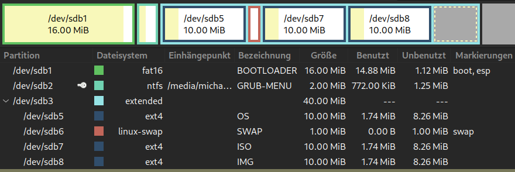
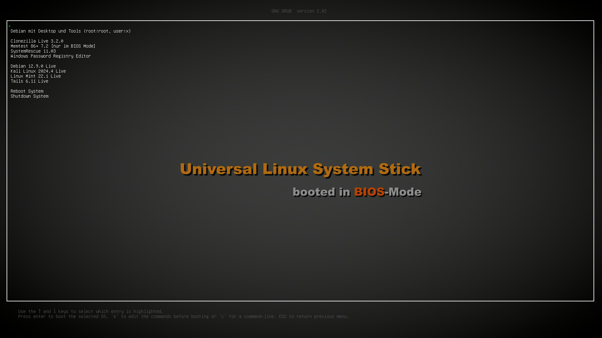

# Universal Bootloader
Universeller <b>Bootloader</b> für <b>BIOS</b> und <b>EFI</b>-Systeme auf Basis des <a href="https://www.gnu.org/software/grub/">GRUB Bootloaders</a>.

Zur Erstellung beispielsweise eines boot-fähigen USB-Sticks, der sowohl auf <b>BIOS</b>-Systemen als auch auf <b>EFI</b>-Systemen gleichermaßen startbar ist.

Dazu muss die komprimierte Image-Datei <a href="https://github.com/migacode/universal-bootloader/blob/main/universal-bootloader.img.gz"><strong>universal-bootloader.img.gz</strong></a> mit einem geeigneten Programm wie <b>Balena-Etcher</b> oder dem <b>Gnome-Disk-Utility</b> einfach auf einen USB-Stick gebrannt werden.
Je nach verwendetem Brenn-Programm muss die Datei "<i>universal-bootloader.img</i>" vor dem Brennen noch aus der mit gzip gepackten Datei (.gz) extrahiert werden.

Das Image enthält lediglich den Bootloader selbst, sowie ein Menü mit Beispiel-Einträgen, welches mit einem beliebigen Text-Editor auf die eigenen Anforderungen angepasst werden kann.
Nach dem Brennen des Images auf den USB-Stick enthält dieser zunächst diese zwei Partitionen:
- BOOTLOADER (Partition 1) mit den GRUB-Bootloadern für <b>BIOS</b> und <b>EFI</b>-Systeme.
- GRUB-MENU (Partition 2) mit einer Datei namens grub.cfg, welche nur das anpassbare Menü enthält.
Das Menü wird für sowohl für <b>BIOS</b>- als auch <b>EFI</b>-System gleichermaßen verwendet - bei Bedarf kann jedoch der Hintergrund für beide Varianten individuell eingestellt werden - diese sind in den Konfigurations-Dateien <i>grub.cfg<i> des entprechenden Boot-Modus in der BOOTLOADER-Partition hinterlegt.

Darüber hinaus sind auf dem USB-Stick folgende weitere Partitionen zu finden, welche jedoch nur der besseren Nachvollziehbarkeit der Einträge im Menü dienen, und in dieser Form natürlich weder eingerichtet noch sinnvoll zu nutzen sind. Diese Partitionen müssen je nach Verwendung des USB-Sticks individuell angepasst bzw. ersetzt werden.
- OS: Betriebssystem, bspw. Debian
- SWAP: Swap-Bereich für Linux
- ISO: ISO-Dateien
- IMG: IMG-Dateien

 

Beispiel bei Nutzung des <b>Universal Bootloader</b> zur Erstellung eines USB-Sticks mit einigen Linux-Systemen und Tools:

 
